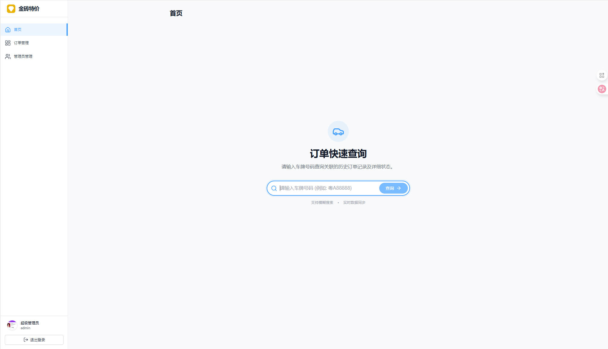
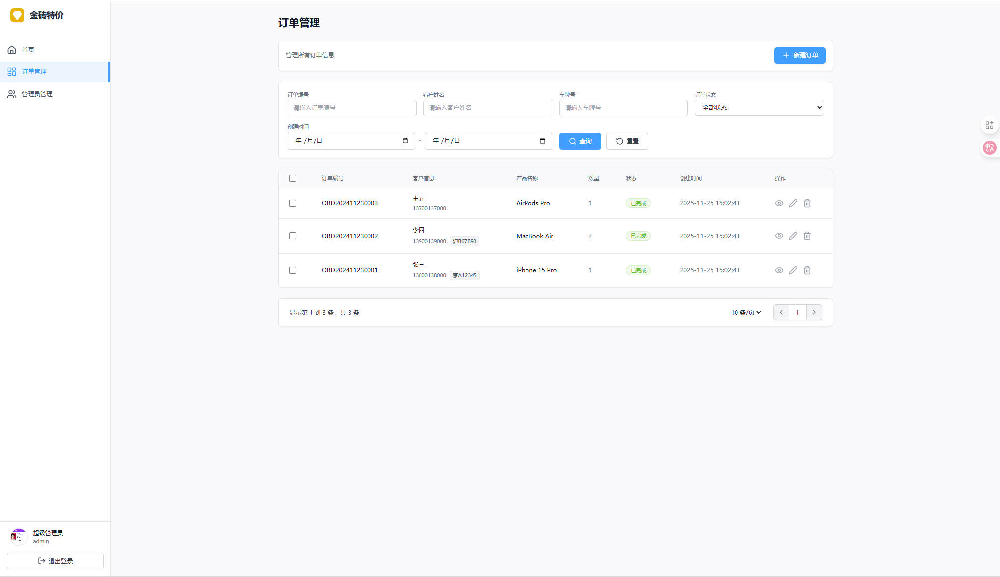
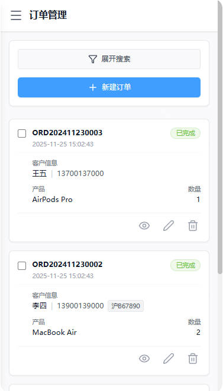

<div align="center">

  <!-- Logo Placeholder: 请替换为实际的 logo 图片路径，例如 ./docs/images/logo.png -->
  

  <h1 style="margin-top: 20px;">🧱 金砖特价 (Gold Brick OMS)</h1>

  <p align="center">
    <strong>新一代轻量级订单管理与查询系统</strong>
    <br />
    基于 React 19 + TypeScript + Tailwind CSS 打造
  </p>

  <!-- Badges -->
  <p>
    <a href="https://react.dev/"></a>
    <a href="https://www.typescriptlang.org/"></a>
    <a href="https://tailwindcss.com/"></a>
    <a href="https://axios-http.com/"></a>
    
  </p>

  <!-- Quick Links -->
  <p>
    <a href="#-快速开始">🚀 快速开始</a> •
    <a href="#-功能特性">✨ 功能特性</a> •
    <a href="#-系统架构">🛠 系统架构</a> •
    <a href="#-项目演示">📸 项目演示</a>
  </p>
</div>

---

## 📖 项目简介 (Introduction)

**金砖特价 (Gold Brick Special Price)** 是一套专为汽车服务或零售行业设计的高效订单管理解决方案。它解决了传统订单管理中“查询难、管理乱、交互差”的痛点。

系统创新性地采用了 **无构建 (No-Build)** 的开发模式，利用现代浏览器的 **Import Maps** 特性直接加载 React 19 和 ESM 模块，极大降低了开发环境的配置复杂度。

**核心价值：**
1.  **公共查询端**：用户可通过车牌号快速检索历史订单与状态，无需登录，极其便利。
2.  **管理后台**：管理员通过安全认证后，可进行全生命周期的订单管理、人员维护及数据统计。

## ✨ 功能特性 (Features)

### 🚗 客户端 (Client Side)
- ✅ **极速查询**：基于车牌号的模糊/精确搜索，秒级返回订单历史。
- ✅ **状态追踪**：清晰展示订单状态（待提货 🟡、已完成 🟢、已取消 🔴）。
- ✅ **响应式设计**：完美适配移动端与桌面端，移动端自动切换为卡片视图。

### 🛡 管理端 (Admin Side)
- ✅ **安全认证**：集成 Sa-Token 规范，支持 JWT 令牌管理、拦截器鉴权及 401 自动登出。
- ✅ **订单全周期管理**：
    - 支持新建、编辑、查看详情。
    - **批量操作**：支持多选订单进行批量删除，操作更高效。
    - **高级筛选**：支持按日期、状态、客户名、车牌号等多维度组合搜索。
- ✅ **人员管理**：
    - 管理员 CRUD（增删改查）。
    - **头像上传**：集成图片上传接口，支持实时预览。
    - 状态控制：一键禁用/启用管理员账号。
- ✅ **交互体验**：内置 Toast 通知、确认弹窗 (Dialog)、侧边栏导航、加载骨架屏。

## 📸 项目演示 (Screenshots)

> 📷 **截图说明**：请将您的项目运行截图放入 `docs/images/` 文件夹，并替换下方的占位链接。

### 1. 首页与查询 (Home & Search)
简洁大气的搜索入口，支持车牌号自动补全与历史记录展示。

| 桌面端首页 | 查询结果页 |
|:---:|:---:|
|  |  |

### 2. 订单管理 (Order Management)
核心业务区域，支持复杂筛选与批量操作。



### 3. 移动端适配 (Mobile Responsive)
在手机上也能流畅管理业务。

<div align="center">
  
  
  
</div>

## 🚀 快速开始 (Quick Start)

本项目依赖后端 API 服务，请确保后端服务已启动。

### 前置要求
- Node.js (仅用于运行静态服务器，如 `http-server`)
- 现代浏览器 (Chrome/Edge/Firefox) 支持 ES Modules

### 安装与运行

由于本项目采用 Import Map + ESM 方式，无需复杂的 `npm install` 构建过程即可开发。

1. **克隆仓库**
   ```bash
   git clone https://github.com/your-username/gold-brick-oms.git
   cd gold-brick-oms
   ```

2. **启动本地服务器**
   你需要一个静态文件服务器来运行项目（因为浏览器不直接支持本地文件系统的 ESM 导入）。

   使用 `npx` (无需安装):
   ```bash
   npx http-server . -p 3000
   ```
   或者使用 VS Code 的 **Live Server** 插件。

3. **访问项目**
   打开浏览器访问 `http://localhost:3000`。

### 后端接口配置
打开 `services/api.ts` 文件，根据实际后端地址修改 `BASE_URL`：

```typescript
// services/api.ts
const BASE_URL = 'http://localhost:8080/api'; // 修改为你的后端地址
```

## 📂 目录结构 (Directory Structure)

```text
gold-brick-oms/
├── index.html              # 入口 HTML (包含 Import Maps 和 Tailwind 配置)
├── index.tsx               # React 挂载入口
├── App.tsx                 # 主应用逻辑与路由分发
├── metadata.json           # 项目元数据配置
├── types.ts                # TypeScript 类型定义 (Models/Interfaces)
├── services/
│   └── api.ts              # Axios 封装与 API 请求层 (拦截器配置)
├── components/             # 组件目录
│   ├── Layout.tsx          # 整体布局 (侧边栏、Header)
│   ├── HomePage.tsx        # 首页 (车牌查询)
│   ├── LoginPage.tsx       # 登录页
│   ├── OrderManager.tsx    # 订单管理列表 (核心业务)
│   ├── OrderModal.tsx      # 订单 新增/编辑/详情 弹窗
│   ├── AdminManager.tsx    # 管理员管理
│   ├── AdminModal.tsx      # 管理员 新增/编辑 弹窗 (含头像上传)
│   ├── ConfirmDialog.tsx   # 通用确认对话框
│   └── AdvancedSearchDrawer.tsx # 高级搜索抽屉
└── docs/
    └── images/             # 文档图片资源
```

## 🛠 系统架构 (Architecture)

以下流程图展示了前端与后端的交互逻辑及权限控制流：

```mermaid
graph TD
    User[用户访问] --> CheckAuth{是否有 Token?};
    
    subgraph 公共区域
    CheckAuth -- 无 --> PublicAccess[LoginPage / HomePage];
    PublicAccess --> SearchAPI[API: /orders/search (无需鉴权)];
    PublicAccess --> LoginAPI[API: /auth/login];
    end
    
    subgraph 鉴权区域
    CheckAuth -- 有 --> Layout[Layout (Sidebar + Header)];
    Layout --> UserInfo[API: /auth/info];
    UserInfo -- 401 Unauthorized --> Logout[清除 Token 并跳转登录];
    
    Layout --> OrderMgr[订单管理];
    Layout --> AdminMgr[管理员管理];
    
    OrderMgr --> OrderAPI[API: /orders (CRUD)];
    AdminMgr --> AdminAPI[API: /admin (CRUD)];
    AdminMgr --> UploadAPI[API: /upload/image];
    end
```

## ⚙️ 核心技术细节

### 1. 样式系统 (Tailwind CSS)
本项目在 `index.html` 中直接通过 CDN 引入 Tailwind CSS 并配置了自定义主题，无需构建步骤即可使用原子化 CSS。

```javascript
tailwind.config = {
    theme: {
        extend: {
            colors: {
                primary: '#409eff', // 品牌主色
                gold: '#f59e0b',    // 金砖特色
            },
            animation: {
                'fade-in-down': 'fade-in-down 0.3s ease-out',
            }
        }
    }
}
```

### 2. 权限控制
- **Token 注入**：`api.ts` 中的拦截器会自动将 `localStorage` 中的 token 注入到 `Authorization` (Bearer) 和 `satoken` 请求头中。
- **全局拦截**：监听自定义事件 `auth:unauthorized`，当后端返回 401 时实现无感知的安全登出。

## 🤝 贡献指南 (Contribution)

欢迎提交 Issue 或 Pull Request！

1. Fork 本仓库
2. 创建特性分支 (`git checkout -b feature/AmazingFeature`)
3. 提交更改 (`git commit -m 'Add some AmazingFeature'`)
4. 推送到分支 (`git push origin feature/AmazingFeature`)
5. 提交 Pull Request

## ❓ 常见问题 (FAQ)

<details>
<summary><strong>Q: 为什么上传图片显示失败？</strong></summary>
A: 请检查后端 API 是否支持 `multipart/form-data`，并确保 `services/api.ts` 中的 `uploadImage` 方法请求头设置正确。前端会尝试解析返回的 `imageUrl`。
</details>

<details>
<summary><strong>Q: 如何修改表格的分页大小？</strong></summary>
A: 在 `OrderManager.tsx` 或 `AdminManager.tsx` 的 `pagination` 状态中修改 `pageSize` 默认值即可。
</details>

<details>
<summary><strong>Q: 为什么不需要 npm install 和 build？</strong></summary>
A: 本项目使用了 ES Modules 和 Import Maps，现代浏览器可以直接从 CDN 加载 React 等依赖。这使得开发极其轻量，但在生产环境建议配合 HTTP/2 服务器或简单的打包流程以优化加载性能。
</details>

## 📄 许可证 (License)

本项目采用 **MIT 许可证** - 详情请参阅 [LICENSE](LICENSE) 文件。

---

<div align="center">
  <p>Made with ❤️ by Gold Brick Team</p>
</div>
